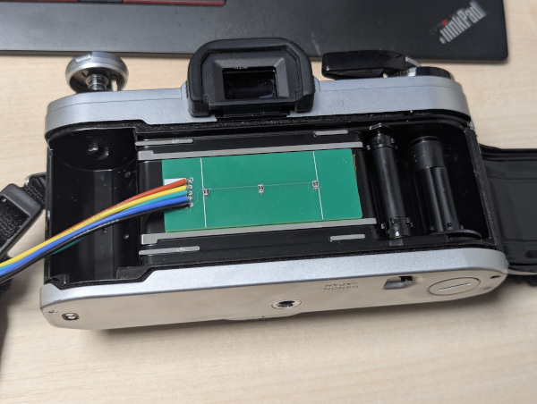

Shutter timing tool
===



This repository contains source code and schematics for the shutter timing tool.
It is designed to measure following timings of Canon AE-1:

* exposure time
* curtain travel time (opening/closing)

## BOM

* [pcb](./pcb)
  * `VEMD4200FX01` photodiodes (x3)
  * SMD 0805 510k Ohm resistors (x3)
* Raspberry Pico
* USB to UART module

## How to use

### Upload the firmware to RPI Pico

```shell
platformio run -t upload -e pico
```

### Connect PCB to the RPI Pico

PCB sensor's pins shoud be connected to the RPI Pico's  `ADC0`, `ADC1`, `ADC2`.
(`ADC0` is for the rightmost sensor when you see it from the back of the camera,
and `ADC2` is for the leftmost one)

### Monitor `UART0 RX` pin

`UART0 RX` pin is used to report the timing.
Connect it to your PC through USB to UART module.

I've used `platformio device monitor --baud 115200`

### Place PCB on the film plane.

Align the board so that all three sensors are exposed when the shutter is opened.

### Place a light source in front of the camera

Remove the lens, and place a light source in front of the camera.
The light source should be bright and uniform.

### Release the shutter

Output from `UART0 RX` should look like this:
```
exposure: 170.0 ms, opening: 12312 us, closing: 11231 us
exposure: 83.1 ms, opening: 12312 us, closing: 11231 us
```

* exposure: exposure time of `ADC1` (middle sensor).
* opening: the travel time of the opening curtain.
It is measured as the interval between the time `ADC0` is exposed and the time `ADC2` is exposed.
* closing: the travel time of the closing curtain.
It is measured as the interval between the time `ADC0` is no longer exposed  and the time `ADC2` is no longer exposed.